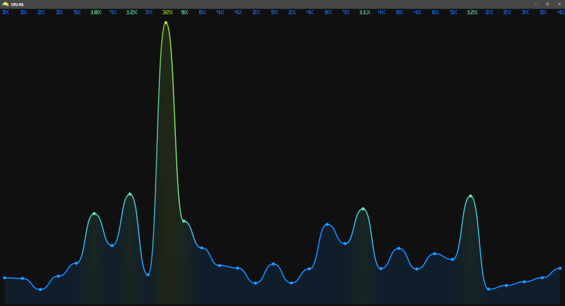

## Resource Monitor Utility



* Monitors entire CPU load (among other categories) and displays the results in a graph using `Microcharts`. 
* This project contains a good collection of native Win32 API calls as well as extension methods, but only a select few are used.
* Other Nuget packages include: `Microcharts`, `SkiaSharp.Views.WinUI`, `System.Diagnostics.PerformanceCounter` and `System.Drawing.Common`. 
* I have added calls to update the taskbar application icon in real-time and demonstrate two ways to do this.
  One technique uses the `Microsoft.UI.Windowing.AppWindow.SetIcon` and the other uses the Win32 API **SendMessage** call by passing the icon handle (*requires System.Drawing.Common*).
* I recommend keeping this project in an **Unpackaged** format, as it was meant to be a portable utility.
* About the `PerformanceCounters`, there are approximately 2 giga-zillion categories and sub-categories, I am only showing four 
  extremely common counters in this utility. One could go mad investigating them all. e.g. there is a multi-instance
  "SystemRestore" category which contains another instance category named "ServiceModelService" which exposes 35 sub-categories.
  Your categories may differ from the example due to the version of OS and what features you have enabled/disabled.

## Usage
* You can run this as a normal desktop app, or by launching the executable or from the command line:
    - ```C:\>monitor disk 2 -4 695 1925 350 2.5```
        - would mean to start a disk usage graph on monitor #2 starting at screen coord -4,695
          and a window having a width of 1925 and a height of 350 and an update frequency of 2.5 seconds.
    - A shortcut could be made in `shell:startup` with these parameters.
    - All settings are stored in the running folder location under the name `Settings.xml`

## License/Warranty
* Permission is hereby granted, free of charge, to any person obtaining a copy of this software and associated documentation files (the "Software"), to deal in the Software without restriction, including without limitation the rights to use, copy, modify, merge, publish, distribute, sublicense, and/or sell copies of the Software, and to permit persons to whom the Software is furnished to do so, subject to the following conditions: The above copyright notice and this permission notice shall be included in all copies or substantial portions of the Software.
* The software is provided "as is", without warranty of any kind, express or implied, including but not limited to the warranties of merchantability, fitness for a particular purpose and noninfringement. In no event shall the author or copyright holder be liable for any claim, damages or other liability, whether in an action of contract, tort or otherwise, arising from, out of or in connection with the software or the use or other dealings in the software.
* Copyright © 2022–2023. All rights reserved.

## Proofing
* This application was compiled and tested using *VisualStudio* 2022 on *Windows 10* versions **22H2**, **21H2** and **21H1**.
* No memory leaks were observed using `Microcharts`, however memory leaks were observed using `OxyPlot`.
  I have created an issue on *github* concerning the `OxyPLot` [memory leak](https://github.com/oxyplot/oxyplot/issues/2025)


